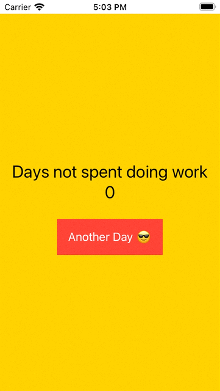

# SwiftUI Demo Projects
## Adapted from Swift Accelerator 2020 Demos
> The projects below are ordered alphabetically.

| Project          | Description                                            | What's Covered  |
|:----------------:|--------------------------------------------------------|-----------------|
|  |<h3>[Advanced Clicker](https://github.com/tinkercademy/swiftui-demo/tree/main/Advanced%20Clicker)</h3>2 screen clicker with a countdown timer and score list | `List`, `Array`, `@Binding`, `@Environment`, `presentationMode`|
|  |<h3>[Advanced Clicker Version 2 - with animations](https://github.com/tinkercademy/swiftui-demo/tree/main/Advanced%20Clicker%20Version%202%20-%20with%20animations)</h3> Animated countdown where the numbers change in opacity and scale | Animations, `.animation`, `.opacity`, `.scaleEffect`, ternary operators | 
|  | <h3>[Cat Fact](https://github.com/tinkercademy/swiftui-demo/tree/main/Cat%20Fact)</h3>Sending a GET request to a Cat Fact API | `URLSession`, `@ObservedObject`, `ObservableObject`, `Codable`, `JSONDecoder`| 
|  | <h3>[Clicker](https://github.com/tinkercademy/swiftui-demo/tree/main/Clicker)</h3>Press a button and increment a counter | `Button`, `Text`, `VStack`, `.background`, `Color`, `.padding`, `.font`, `@State`|
|  | <h3>[Clicker Version 2](https://github.com/tinkercademy/swiftui-demo/tree/main/Clicker%20Version%202)</h3>When user hits a certain number of clicks, show congratulatory text | `String` interpolation, Conditionals|
|  | <h3>[Clicker Version 3](https://github.com/tinkercademy/swiftui-demo/tree/main/Clicker%20Version%203)</h3>Timer with clicker, click to 30 and get the number of seconds it took | `Timer` |
|  | <h3>[Ego App](https://github.com/tinkercademy/swiftui-demo/tree/main/Ego%20App)</h3>a ridiculous cat worshipping app with `TabView` and crazy animations. | `LazyVStack`, custom fonts, Animations - Rotation, Scale, Background, `TabView` |
|  | <h3>[Ego App Version 2](https://github.com/tinkercademy/swiftui-demo/tree/main/Ego%20App%20Version%202)</h3>Upload images! Also embedding UIKit into SwiftUI | `UIViewControllerRepresentable`, `UIImagePickerController`|
| **No Preview 😢** | <h3>[Firey Todos](https://github.com/tinkercademy/swiftui-demo/tree/main/Firey%20Todos)</h3>Collaborative Todos | Swift Package Manager, Firebase Real-Time Database, Firebase Authentication |
|  | <h3>[Friends List Version 1](https://github.com/tinkercademy/swiftui-demo/tree/main/Friends%20List%20Version%201)</h3>Friends list app | `NavigationView`, passing objects through views, `List` |
|  | <h3>[Friends List Version 2](https://github.com/tinkercademy/swiftui-demo/tree/main/Friends%20List%20Version%202)</h3>Friends list app with sloths?! | `Image`, importing external images, `resizable()`, `aspectRatio` |
|  | <h3>[Friends List Version 3](https://github.com/tinkercademy/swiftui-demo/tree/main/Friends%20List%20Version%203)</h3>Sloths, Sliders & Safari | `SafariServices`, `UIViewControllerRepresentable`, `Slider` |
|  | <h3>[Friends List Version 4](https://github.com/tinkercademy/swiftui-demo/tree/main/Friends%20List%20Version%204)</h3>Manipulating, Deleting, Moving and Editing Friends | `ForEach`, `onDelete`, `onMove` |
|  | <h3>[Friends List Version 5](https://github.com/tinkercademy/swiftui-demo/tree/main/Friends%20List%20Version%205)</h3>Binding friends, Adding and Editing friends | Custom `List`s, `Appending`, `@Binding`|
|  | <h3>[Friends List Version 6](https://github.com/tinkercademy/swiftui-demo/tree/main/Friends%20List%20Version%206)</h3>Persistent Friends, Saving Friends | `Codable`, `PropertyList` |
|  | <h3>[Instagram](https://github.com/tinkercademy/swiftui-demo/tree/main/Instagram)</h3>We built a $100 billion app | `+=`, `@State`, `maxWidth`, `maxHeight`, `backgroundColor`|
|  | <h3>[Jokes Version 1](https://github.com/tinkercademy/swiftui-demo/tree/main/Jokes%20Version%201)</h3>a simple jokes app with a punchline and a setup | `Array`, `onTapGesture`, `@State`, Conditionals |
|  | <h3>[Jokes Version 2](https://github.com/tinkercademy/swiftui-demo/tree/main/Jokes%20Version%202)</h3>a more organised jokes app | Modals, `struct` |
|  | <h3>[Jokes Version 3](https://github.com/tinkercademy/swiftui-demo/tree/main/Jokes%20Version%203)</h3>Rate jokes! Like every great company, we don't take feedback into account. Feedback is just an illusion. | `Alert` |
|  | <h3>[Jokes Version 4](https://github.com/tinkercademy/swiftui-demo/tree/main/Jokes%20Version%204)</h3>Celebrate good feedback, criticise bad ones. It has cats. | Presenting new screens using `sheet` |
|  | <h3>[Jokes Version 5](https://github.com/tinkercademy/swiftui-demo/tree/main/Jokes%20Version%205)</h3>Jokes `withAnimation`. The rotating and pulsing animals really helps to drive the point whether it is that we appreciate their feedback or we hate them. | `withAnimation`, `scaleEffect`, `rotation` |
|  | <h3>[Quiz Version 1](https://github.com/tinkercademy/swiftui-demo/tree/main/Quiz%20Version%201)</h3>Kahoot-themed Quiz app with no functionality, laying out UI components | `VStack`, `HStack`, spacing |
|  | <h3>[Quiz Version 2](https://github.com/tinkercademy/swiftui-demo/tree/main/Quiz%20Version%202)</h3>Functioning Quiz App with pop-up results and questions | Conditional UI, `struct` |
|  | <h3>[Text Field Quiz](https://github.com/tinkercademy/swiftui-demo/tree/main/Text%20Field%20Quiz)</h3>A quiz app, with a text field and some cats | `@Binding`, Handling Return Key |
| **No Preview 😢**  Also this project is kinda broken for now. | <h3>[Todo Version 1](https://github.com/tinkercademy/swiftui-demo/tree/main/Todo%20Version%201)</h3>Todo list app | `struct`, `List Style`, `@Binding` |
| **No Preview 😢**  Also this project is kinda broken for now. | <h3>[Todo Version 2](https://github.com/tinkercademy/swiftui-demo/tree/main/Todo%20Version%202)</h3>Persistent todo list app | `Codable` |
